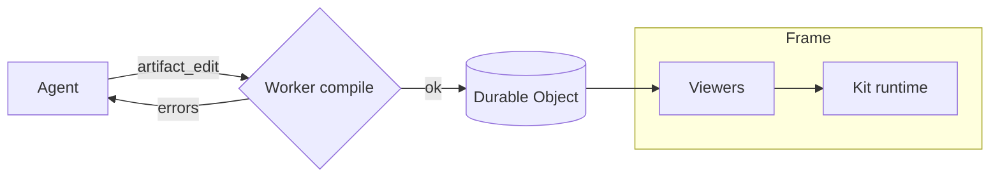
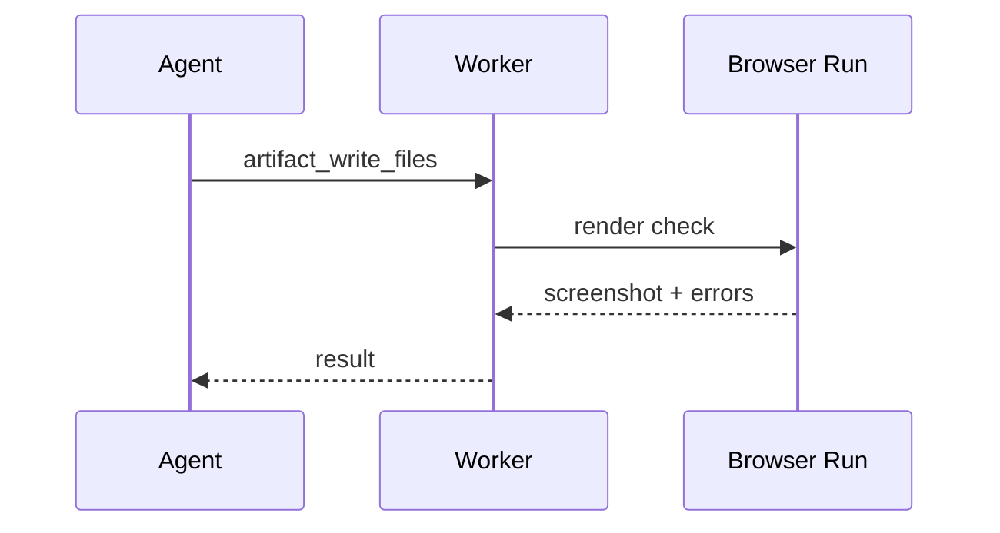
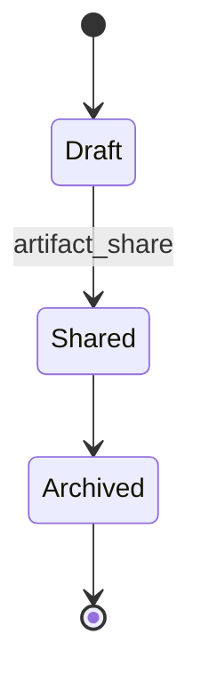
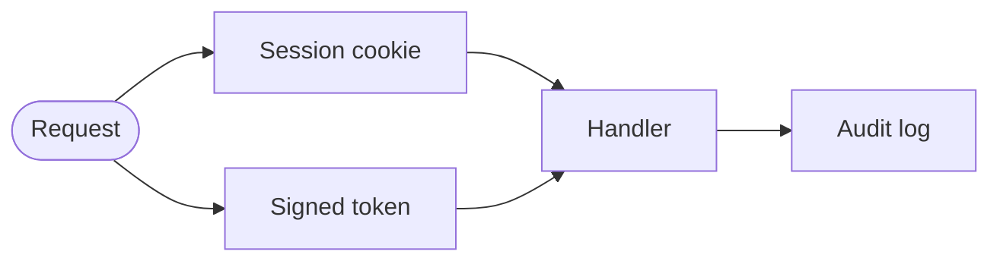

# Diagrams

How a write reaches viewers.


```mermaid
flowchart LR
  A[Agent] -->|artifact_edit| W{Worker compile}
  W -- errors --> A
  W -- ok --> DO[(Durable Object)]
  DO --> V[Viewers]
  subgraph Frame
    V --> K[Kit runtime]
  end
```

## Sequence


```mermaid
sequenceDiagram
  participant A as Agent
  participant W as Worker
  participant B as Browser Run
  A->>W: artifact_write_files
  W->>B: render check
  B-->>W: screenshot + errors
  W-->>A: result
```

## State


```mermaid
stateDiagram-v2
  [*] --> Draft
  Draft --> Shared: artifact_share
  Shared --> Archived
  Archived --> [*]
```

## What changed


```mermaid
flowchart LR
  Req([Request]) --> Old[Session cookie]:::removed
  Req --> New[Signed token]:::added
  Old --> App[Handler]
  New --> App
  App --> Log[Audit log]:::changed
```

```diff
-  session: cookie,
+  session: signedToken(user),
   audit: true,
```
