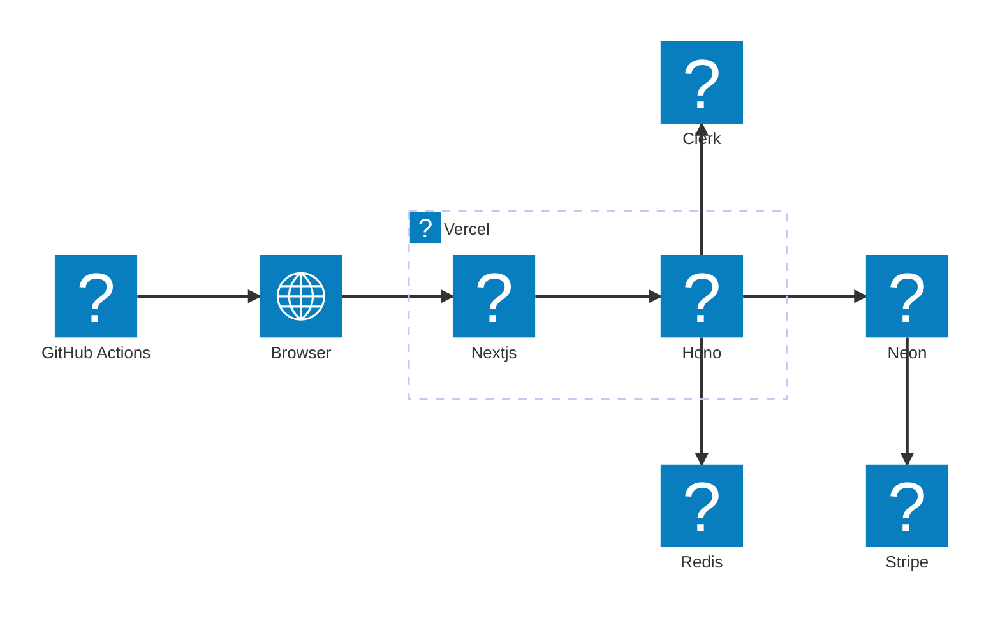
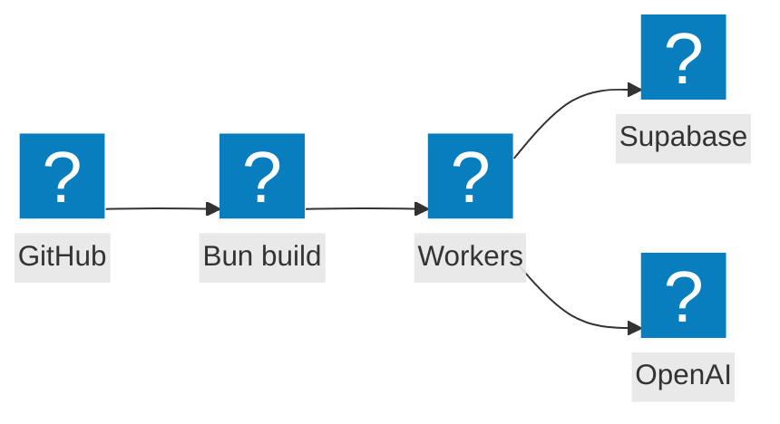
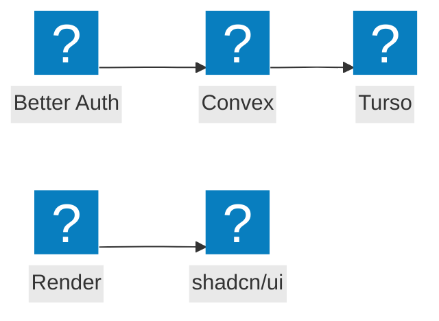

# Diagram logos

Logos drawn as is (Hono, Neon, Supabase), in the text colour (Vercel, GitHub), and on a plate (Next.js, Redis, Bun).

```mermaid
architecture-beta
  group vercel(logos:vercel)[Vercel]
  service web(logos:nextjs)[Nextjs] in vercel
  service api(logos:hono)[Hono] in vercel
  service db(logos:neon)[Neon]
  service cache(logos:redis)[Redis]
  service auth(logos:clerk)[Clerk]
  service pay(logos:stripe)[Stripe]
  service ci(logos:github-actions)[GitHub Actions]
  service user(internet)[Browser]

  user:R --> L:web
  web:R --> L:api
  api:R --> L:db
  api:B --> T:cache
  api:T --> B:auth
  db:B --> T:pay
  ci:R --> L:user
```

```mermaid
flowchart LR
  gh@{ icon: "logos:github-icon", label: "GitHub" } --> b@{ icon: "logos:bun", label: "Bun build" }
  b --> w@{ icon: "logos:cloudflare-workers", label: "Workers" }
  w --> s@{ icon: "logos:supabase", label: "Supabase" }
  w --> o@{ icon: "logos:openai", label: "OpenAI" }
```

Marks vendored from svgl:

```mermaid
flowchart LR
  a@{ icon: "logos:better-auth", label: "Better Auth" } --> c@{ icon: "logos:convex", label: "Convex" }
  c --> t@{ icon: "logos:turso", label: "Turso" }
  r@{ icon: "logos:render", label: "Render" } --> s@{ icon: "logos:shadcn", label: "shadcn/ui" }
```
